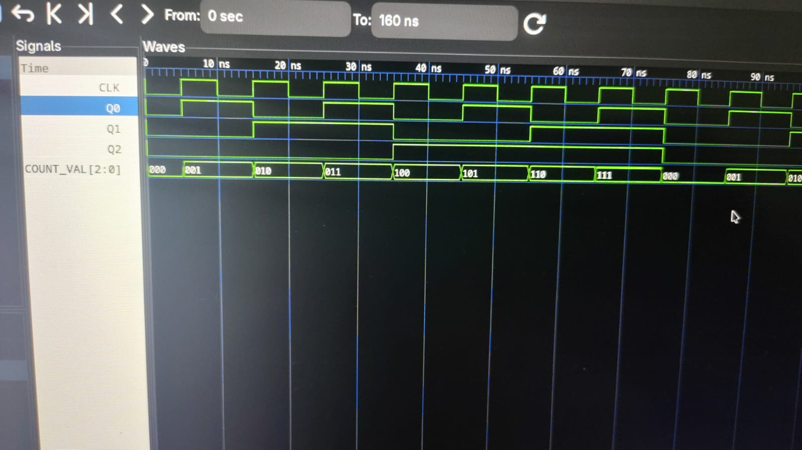

# bdl
Banni's Digital library in c++ with a few basic digital components set up for you :-) !

@kajuburfi has formatted the cpp files using `clang-format`, to maintain a standard.

> Note: This is still a work in progress.

## Structure

Here is the output of `tree .`:
```
.
├── docs
│   └── counter_testbench_img.jpeg
├── dynamic
│   ├── bdllibrary.hpp
│   ├── testbenches
│   │   └── counter_testbench.cpp
│   └── transpiler.cpp
├── LICENSE
├── README.md
├── sample.gates
├── static
│   ├── bdllibrary.hpp
│   ├── proc.hpp
│   ├── testbenches
│   │   ├── Adder4b_testbench.cpp
│   │   ├── counter_testbench.cpp
│   │   └── tb_proc.cpp
│   └── transpiler.cpp
└── vcd_dumper.hpp
```

`bdllibrary.hpp` contains all the basic combinatorial and sequential circuits that one needs.
We can see it at a glance in the below class diagram.
Note: `static/` is the main directory, `dynamic/` is a work-in-progress model with gates that can have variable values without reinitialising the object.

We also have a `counter_testbench.cpp`, which is a test bench to test our counter3b which is derived in combinational(in `bdllibrary.hpp`).
This also tests our `vcd_dumper.hpp`. 
Here is a sample output of the above testbench.


We also have a `proc.hpp`, which is the beginning of a processor. It currently has an ALU.

Alongside the above, We also have a `transpiler.cpp`, and a `sample.gates`. This is a custom format, which enables us to write easy modules.
(The idea is based upon Verilog modules). The format is a bit tricky, and based upon the reverse Polish notation of postfix stack operations.
When we run transpiler on the `sample.gates`, by the following format,
```
$ cat sample.gates | ./transpiler
```
We get an output to stdout, which is a module in the form of a CPP class, which can directly be used in our programs.

Here's an ASCII class diagram depicting only inheritances:

```
                                                   +---------------+
                                                   |   Circuits    |
                                                   +---------------+
                                                     ▲           ▲
                                                     │           │
                             ┌───────────────────────┘           └───────────────────────┐
                             │                                                           │
                     +---------------+                                           +---------------+
                     | Combinational |                                           |  Sequential   |
                     +---------------+                                           +---------------+
                       ▲           ▲                                                      ▲
                       │           │                                                      │
 ┌─────────────────────┘           └───────────┐                                          │
 │                                             │                                          │
 │  [bdllibrary.hpp]                           │ [proc.hpp]                               │  [bdllibrary.hpp]
 ├── Nand                                      ├── Not16                                  ├── Dlatch2
 ├── Nor                                       ├── And16                                  ├── Dflipflop
 ├── Not                                       ├── Or16                                   └── Counter3b
 ├── And                                       ├── Xor16       
 ├── Or                                        ├── Nand16     
 ├── Xor                                       ├── Nor16      
 ├── Xnor                                      ├── Adder16    
 ├── Mux                                       ├── AddSub16   
 ├── Demux                                     ├── Inc16      
 ├── Encoder                                   ├── Dec16      
 ├── Decoder                                   ├── Shl16      
 ├── Comparator                                ├── Shr16      
 ├── Multiplier                                ├── Comparator16
 ├── Full_Adder                                ├── Multiplier16
 └── Ripplecarryadder4b                        ├── Mux16      
                                               └── ALU16 
```

